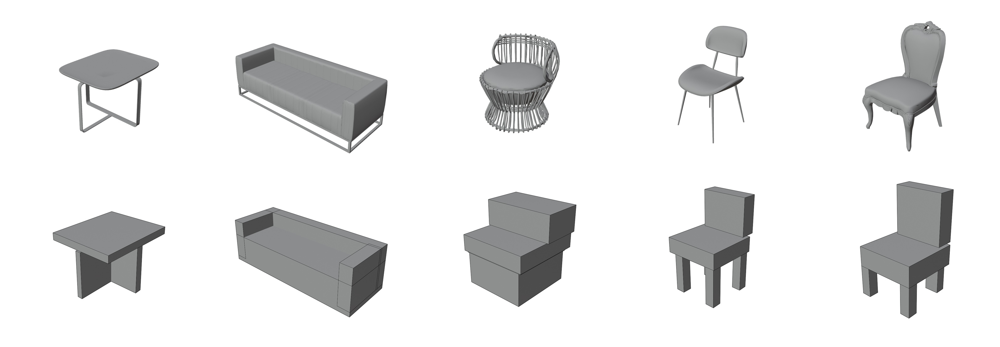

# 3DFRONT-NC Dataset

**3DFRONT-NC**  is an enhanced dataset derived from [3D-FUTURE](https://tianchi.aliyun.com/specials/promotion/alibaba-3d-scene-dataset) and [3D-FRONT](https://tianchi.aliyun.com/specials/promotion/alibaba-3d-scene-dataset). This dataset introduces a cuboid-based structural representation of furniture and utilizes it to refine 3D indoor scene layouts. The process consists of two main stages:

## 📦 Part 1: Cuboid Assemblies for 3D-FUTURE Models



We convert complex 3D-FUTURE meshes into **cuboid assemblies** to represent furniture models, i.e., a set of axis-aligned cuboids approximating the furniture's geometry and structure. The resulting cuboid assemblies offer compact, interpretable, and editable representations of furniture. We have processed a total of 4,356 furniture pieces used in 3D-FRONT and stored them in the `part1/data/cuboids_dict.json` file.

### Usage

To visualize the cuboid assemblies, you can use the provided script to export them to OBJ format. The exported model size should match the size of the corresponding `raw_model.obj` in 3D-FUTURE.

```bash
# Navigate to the part1/scripts directory
cd part1

# Export a specific model's cuboid assembly to OBJ format
python scripts/export_obj.py --sample_id 1c648cfd-6eca-4a84-af58-b62a3a4d173a
```

This will create an OBJ file named `output_1c648cfd-6eca-4a84-af58-b62a3a4d173a.obj` that can be opened in any 3D modeling software.

## 🏠 Part 2: Refined 3D-FRONT Scenes

We use the structured cuboid assemblies to enhance the original 3D-FRONT indoor scenes. We adjust object placements to resolve collisions, enhance support relationships, and ensure stability.

*Note: Although the scenes are significantly improved, some collision issues may still remain in the dataset.*


## 📝 TODOs

- [x] Release Part 1 data (cuboid assemblies for 3D-FUTURE models)
- [ ] Release Part 2 data (refined 3D-FRONT scenes)
- [ ] Release the code for generating cuboid assemblies
- [ ] Release the code for refining 3D-FRONT scenes using cuboid structures 
